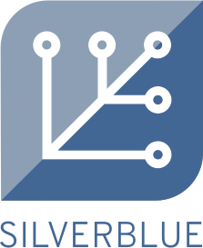
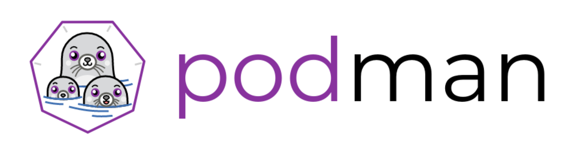

% { width=128 }\
  Pet Containers\
  in Fedora
% Jens Petersen\
  <petersen@redhat.com>
% Devconf.in 2019, Bangalore (2 Aug)

# Developing with containers

## container tools

## container as pristine environment

## container as development environment

# Fedora Silverblue

{ width=300 } &emsp;
{ width=256 }

## What is Fedora Silverblue?

- immutable OS: `/usr` is read-only
- uses [rpm-ostree](https://github.com/projectatomic/rpm-ostree) instead of dnf
- image deployments: atomic updates

## Fedora Atomic project

Fedora Atomic Host → Fedora CoreOS

Fedora Atomic Workstation → Fedora Silverblue

RHEL Atomic Host → RHEL CoreOS

CentOS Atomic Host

## Adding software to Fedora Silverblue

- package layering (rpm-ostree)
- Flatpaks

- how about containers?

# Developing on Silverblue in Toolbox

## 

{ width=640 }

Shell script developed by Debarshi Ray (@rishi)\
 in the Red Hat Desktop team

[debarshiray/toolbox](https://github.com/debarshiray/toolbox) on Github

## Toolbox
uses

{ width=512 }

# Live Demo

# How does Toolbox work?

## Toolbox image

`registry.fedoraproject.org/`\
`f30/fedora-toolbox:30`

## Toolbox script

`/usr/bin/toolbox`

## toolbox create

## toolbox enter

## toolbox run

## Toolbox containers surprisingly complicated

# Pros and cons

## Toolbox pros

- self-contained development environment
  - avoids host package clutter
- easy Fedora Rawhide container environment for development
- saves disk-space by sharing /home
- can run apps from toolboxes on the desktop
  - eg I run Emacs from my Toolbox

## Toolbox problems
- moving targets: podman
- takes time getting used to host/toolbox split
- `mock` & `ping` only work in host
  - can use `flatpak-spawn` for `xdg-open`
- (need VM for real testing)

# Future ideas
- Sharing fonts with host
- Distinguish different toolboxes

 

- Golang rewrite?
- Support for more OS's

## Other Toolboxes

- [cgwalters/coretoolbox](https://github.com/cgwalters/coretoolbox)

- [coreos/toolbox](https://github.com/coreos/toolbox)

# What questions do you have?

## Contact

petersen@redhat.com

@juhp

<small>
<https://petersen.fedorapeople.org/talks/devconf.in-2019-pet-containers>

*(slides created with Pandoc)*

</small>

## More information
<https://silverblue.fedoraproject.org/>

<https://github.com/debarshiray/toolbox>

<https://podman.io/>

<https://flatpak.org/>
